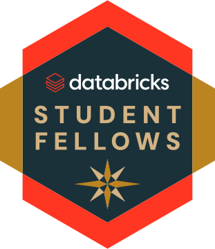
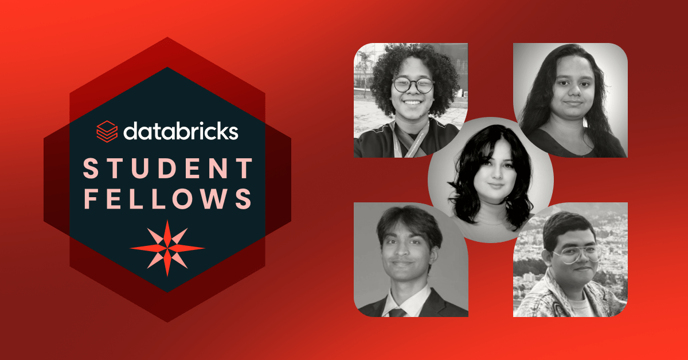

# Nicolas Santos

**Data Engineer · Applied AI Developer**

Computer Science @ UNIFOR &nbsp;•&nbsp; Fortaleza, Brazil

I build data and AI systems that run end to end — from raw public datasets to the interface someone actually uses. Most of my work sits at the intersection of **data engineering** and **local-first LLM applications**: RAG pipelines over clinical documents, natural-language interfaces to epidemiological databases, and desktop AI tools that keep inference on the user's machine instead of in someone else's cloud.

The recurring theme across my projects is **privacy-preserving AI on real public-health data** — systems that stay useful without shipping sensitive records anywhere.

---

## Databricks Student Fellows

> [!IMPORTANT]
> **I was featured as one of the five students spotlighted by the Databricks Student Fellows program.**

The Databricks Student Fellows program recognizes students building with the modern data and AI stack. Out of the whole cohort, five fellows were highlighted by the program — and I'm one of them.

The five featured Databricks Student Fellows.

| | |
|:--|:--|
| **Program** | Databricks Student Fellows |
| **Recognition** | One of 5 featured fellows |
| **Focus** | Data engineering · Applied AI · Open source |

---

## Featured Work

### [Text-to-PySUS — Conversational Analyzer](https://github.com/NicolasDev-web/Text-to-PySUSConversationalAnalyzer)

A conversational data analyst for Brazil's Mortality Information System (SIM/DATASUS). You ask a demographic or epidemiological question in plain language; the system generates Python, executes it inside an **isolated Docker sandbox**, and returns charts with an executive summary.

The hard parts weren't the LLM — they were the data engineering around it: autonomously downloading, caching and filtering DATASUS parquet files, translating cryptic CID-10 codes into readable diagnoses, and choosing a chart type that doesn't collapse under a long tail of categories.

`Python` `Qwen2.5-Coder` `PySUS` `Docker` `Plotly`

---

### [P.U.L.S.E. — Local RAG for Public Health](https://github.com/NicolasDev-web/P.U.L.S.E)

*Pipeline Unique for Reading and Epidemiological Segmentation.*

Clinical guidelines run to hundreds of pages, and healthcare data can't be shipped to a third-party API. P.U.L.S.E. is a fully local RAG system that ingests clinical PDFs and CSVs and answers questions against them — **no data leaves the machine, LGPD-compliant by construction, zero inference cost**.

Built on a Medallion-style architecture adapted for AI workflows: Bronze ingestion → Silver chunking and cleaning → Gold embedding and vector persistence → RAG retrieval.

`Python` `LangChain` `ChromaDB` `Ollama (Phi-3)` `Pandas` `Streamlit`

---

### [NoteAI — Local-First AI Notes](https://github.com/NicolasDev-web/NoteAI)

A desktop note-taking app where both the notes *and* the model live on your machine. A `llama.cpp` sidecar is spawned lazily, streams over loopback HTTP, and shuts itself down when idle. Inline AI actions on selected text, a chat panel grounded in the current note, and full-text search via SQLite FTS5 with BM25 ranking.

It also profiles the host's available RAM on first run and recommends a model that will actually fit.

`Rust` `Tauri 2` `React` `TypeScript` `SQLite (FTS5)` `llama.cpp` `Qwen3`

---

<b>More projects</b>

 

| Project | What it is |
|:--|:--|
| [Churn Prediction](https://github.com/NicolasDev-web/ChurnPrediction) | End-to-end customer churn modelling in a Jupyter workflow |
| [Facebook Ego Networks](https://github.com/NicolasDev-web/TrabalhoGrafosFacebook) | Structural analysis of scale-free behaviour in social graphs |
| [Dijkstra / MST / Graph Coloring](https://github.com/NicolasDev-web?tab=repositories) | Graph algorithm implementations in Python and Java |
| [OS Process Scheduler Simulator](https://github.com/NicolasDev-web/Simulador-de-Processos-e-Escalonamento---SO) | Process scheduling simulator built from scratch in Java |
| [Portfolio](https://github.com/NicolasDev-web/NicolasSantosportfolio) | Personal site, built with TypeScript and React |

---

## Stack

**Languages** &nbsp; Python · TypeScript · JavaScript · SQL · Rust · Java · R

**Data & AI** &nbsp; Pandas · NumPy · LangChain · ChromaDB · Ollama · llama.cpp · Jupyter · Plotly · Streamlit

**Platform** &nbsp; Docker · SQLite · Git · Tauri · React

 

