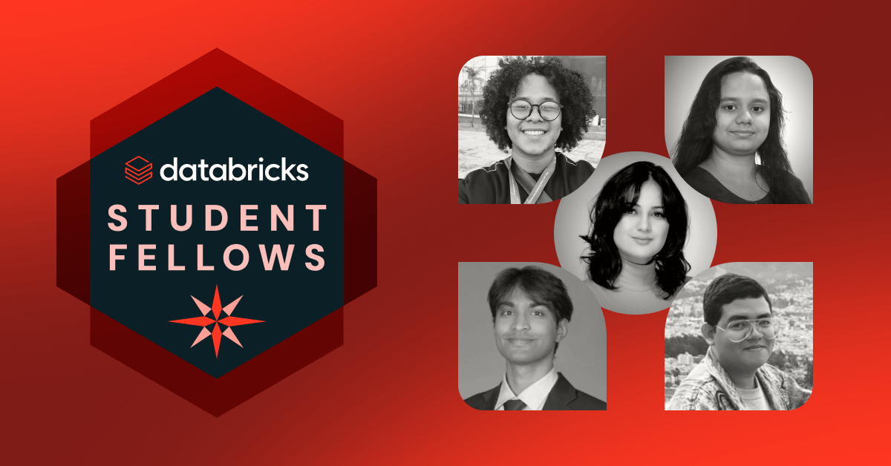

# Nicolas Santos

**Data Engineer · Analytics & Applied AI**

Data Engineering Intern @ MRV&CO &nbsp;·&nbsp; Computer Science @ UNIFOR &nbsp;·&nbsp; Fortaleza, Brazil

**Privacy-preserving AI on real public-health data** — systems that stay useful without shipping sensitive records anywhere.

I build data and AI systems that run end to end — from raw public datasets to the interface someone actually uses. Most of my work sits at the intersection of **data engineering** and **local-first LLM applications**: RAG pipelines over clinical documents, natural-language interfaces to epidemiological databases, and desktop AI tools that keep inference on the user's machine instead of in someone else's cloud.

Alongside that, I work on the analytics side of the same problem — dimensional models, SQL pipelines and BI dashboards that turn the same raw data into something a decision-maker can read.

---

## Featured Work

### [Text-to-PySUS — Conversational Analyzer](https://github.com/NicolasDev-web/Text-to-PySUSConversationalAnalyzer)

A conversational data analyst for Brazil's Mortality Information System (SIM/DATASUS). You ask a demographic or epidemiological question in plain language; the system generates Python, executes it inside an **isolated Docker sandbox**, and returns charts with an executive summary.

The hard parts weren't the LLM — they were the data engineering around it: autonomously downloading, caching and filtering DATASUS parquet files, translating cryptic CID-10 codes into readable diagnoses, and choosing a chart type that doesn't collapse under a long tail of categories.

`Python` `Qwen2.5-Coder` `PySUS` `Docker` `Plotly`

---

### [P.U.L.S.E. — Local RAG for Public Health](https://github.com/NicolasDev-web/P.U.L.S.E)

*Pipeline Unique for Reading and Epidemiological Segmentation.*

Clinical guidelines run to hundreds of pages, and healthcare data can't be shipped to a third-party API. P.U.L.S.E. is a fully local RAG system that ingests clinical PDFs and CSVs and answers questions against them — **no data leaves the machine, LGPD-compliant by construction, zero inference cost**.

Built on a Medallion-style architecture adapted for AI workflows: Bronze ingestion → Silver chunking and cleaning → Gold embedding and vector persistence → RAG retrieval.

`Python` `LangChain` `ChromaDB` `Ollama (Phi-3)` `Pandas` `Streamlit`

---

### [NoteAI — Local-First AI Notes](https://github.com/NicolasDev-web/NoteAI)

A desktop note-taking app where both the notes *and* the model live on your machine. A `llama.cpp` sidecar is spawned lazily, streams over loopback HTTP, and shuts itself down when idle. Inline AI actions on selected text, a chat panel grounded in the current note, and full-text search via SQLite FTS5 with BM25 ranking.

It also profiles the host's available RAM on first run and recommends a model that will actually fit.

`Rust` `Tauri 2` `React` `TypeScript` `SQLite (FTS5)` `llama.cpp` `Qwen3`

---

### [Agente TCE — Agentic Search over Public Contracts](https://github.com/NicolasDev-web/Agente_TCE) &nbsp;· in development

An agent over contract and clause data from the state audit court (Tribunal de Contas do Estado), exposed as a FastAPI service. Retrieval is hybrid by design: **PostgreSQL with pgvector** holds both the relational rows and the embeddings, so semantic search over clauses and structured SQL queries hit the same store instead of two systems drifting apart.

LangGraph orchestrates the decision flow and Langfuse traces every execution — because an agent you can't inspect is an agent you can't debug.

`Python` `LangGraph` `FastAPI` `PostgreSQL + pgvector` `Langfuse`

---

<b>More projects</b>

 

| Project | What it is |
|:--|:--|
| [Student AI-Impact Warehouse](https://github.com/NicolasDev-web/dw-impacto-ia-estudantes) | Star-schema design for an analytics warehouse — declared grain, junk dimension, open modelling trade-offs. Design doc; SQL not yet implemented |
| [Churn Prediction](https://github.com/NicolasDev-web/ChurnPrediction) | End-to-end customer churn modelling in a Jupyter workflow |
| [Facebook Ego Networks](https://github.com/NicolasDev-web/TrabalhoGrafosFacebook) | Structural analysis of scale-free behaviour in social graphs |
| [Dijkstra](https://github.com/NicolasDev-web/-AlgoritmoDeDijkstra) · [MST](https://github.com/NicolasDev-web/ArvoreGeradoraMinima) · [Graph Coloring](https://github.com/NicolasDev-web/ProblemadeColoracaoemGrafos) | Graph algorithm implementations in Python and Java |
| [OS Process Scheduler Simulator](https://github.com/NicolasDev-web/Simulador-de-Processos-e-Escalonamento---SO) | Process scheduling simulator built from scratch in Java |
| [Portfolio](https://github.com/NicolasDev-web/Portfolio) | Source for [nicolassantos.vercel.app](https://nicolassantos.vercel.app/), built with TypeScript and React |

---

## Recognition

**[Databricks Student Fellows](https://www.databricks.com/blog/welcoming-first-cohort-databricks-student-fellows)** — one of five fellows highlighted from the program's inaugural cohort.

The five featured Databricks Student Fellows.

---

## Stack

**Languages** &nbsp; Python · TypeScript · JavaScript · SQL · Rust · Java · R

**Data & Analytics** &nbsp; Power BI · Dimensional modelling · Pandas · NumPy · Jupyter · Plotly

**AI & LLM** &nbsp; LangChain · LangGraph · ChromaDB · pgvector · Ollama · llama.cpp · Langfuse · Streamlit

**Platform** &nbsp; Docker · PostgreSQL · SQLite · Git · Tauri · React

---

Building data and AI systems on public-health data — open to conversations about either.

[**Portfolio**](https://nicolassantos.vercel.app/) &nbsp;·&nbsp; [**LinkedIn**](https://www.linkedin.com/in/nicolas-santos-986861304/) &nbsp;·&nbsp; [**Email**](mailto:nicolasxavier445@gmail.com)

